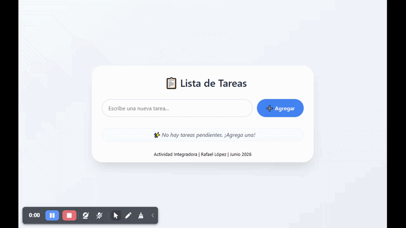

# Aplicación de lista de tareas (To-Do List)

> Actividad Integradora | INGE00029 Servicios Web | ULA

Aplicación web simple de lista de tareas con operaciones **CRUD** (Crear, Leer, Actualizar, Eliminar).  
Desarrollada como parte de la actividad integradora de la materia _Servicios Web_.  
Permite agregar tareas, marcarlas como completadas y eliminarlas, todo mediante peticiones **AJAX** sin recargar la página.

## Enlace a la aplicación publica en la web (100% funcional)

[https://todo-list-app-sf9h.onrender.com](https://todo-list-app-sf9h.onrender.com)

---

## Demostración



> Pruebalo en vivo aqui: [https://todo-list-app-sf9h.onrender.com](https://todo-list-app-sf9h.onrender.com)

---

## Stack tecnológico

| Tecnología        | Uso                                    |
| ----------------- | -------------------------------------- |
| **Node.js**       | Entorno de ejecución JavaScript        |
| **Express**       | Framework web del servidor             |
| **MongoDB Atlas** | Base de datos NoSQL en la nube         |
| **Mongoose**      | ODM para modelar los datos             |
| **EJS**           | Motor de plantillas (vista principal)  |
| **jQuery**        | Manipulación del DOM y peticiones AJAX |
| **HTML5 / CSS3**  | Estructura y estilos                   |

---

## Instalación local

### 1. Clonar el repositorio

```bash
git clone https://github.com/tu-usuario/todo-list-app.git
cd todo-list-app
```

### 2. Instalar dependencias

```bash
npm install
```

### 3. Configurar variables de entorno

Crea un archivo `.env` en la raíz del proyecto con el siguiente contenido:

```env
MONGO_URI=mongodb+srv://<usuario>:<contraseña>@cluster0.xxxxx.mongodb.net/todolist
PORT=3000
```

> ⚠️ Obtén tu cadena de conexión gratis desde [MongoDB Atlas](https://www.mongodb.com/atlas).  
> Si prefieres MongoDB local, cambia la URI a `mongodb://localhost:27017/todolist`.

### 4. Ejecutar la aplicación

```bash
npm start
```

O en modo desarrollo (con recarga automática):

```bash
npm run dev
```

### 5. Abrir en el navegador

Ve a `http://localhost:3000`

---

## Estructura del proyecto

```
todo-list-app/
├── public/            # Archivos estáticos (CSS, JS)
│   ├── css/styles.css
│   └── js/app.js
├── views/             # Plantilla EJS
│   └── index.ejs
├── models/            # Modelo de datos Mongoose
│   └── Task.js
├── server.js          # Servidor Express y rutas API
├── .env               # Variables de entorno (no se sube a GitHub)
├── .gitignore
└── package.json
```

---

## API endpoints

| Método | Endpoint         | Descripción                    |
| ------ | ---------------- | ------------------------------ |
| GET    | `/api/tasks`     | Obtener todas las tareas       |
| POST   | `/api/tasks`     | Crear una nueva tarea          |
| PUT    | `/api/tasks/:id` | Actualizar estado (completado) |
| DELETE | `/api/tasks/:id` | Eliminar una tarea             |
